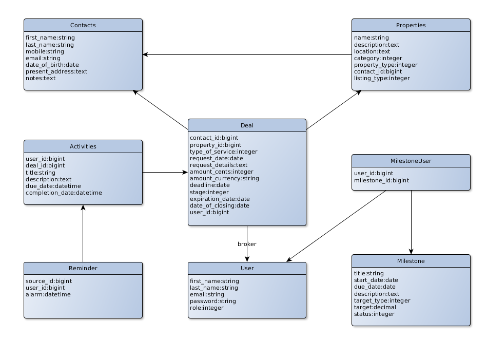

# Westom

Real estate management application. It helps employees track which 
deals are ongoing on the various properties they have, as well as the activities
that are going on under each deal.

## Architecture and models




## Development

##### Prerequisites

The setups steps expect following tools installed on the system.

- Git
- Ruby [2.4.2](https://github.com/peter-ohara/westom/blob/master/.ruby-version#L1)
- Rails [5.1.6](https://github.com/peter-ohara/westom/blob/master/Gemfile#L12)

##### 1. Check out the repository

```bash
git clone git@github.com:peter-ohara/westom.git
```

##### 2. Create database.yml file

Copy the sample database.yml file and edit the database configuration as required.

```bash
cp config/database.yml.sample config/database.yml
```

##### 3. Create and setup the database

Run the following commands to create and setup the database.

```ruby
bundle exec rake db:create
bundle exec rake db:setup
```

##### 4. Start the Rails server

You can start the rails server using the command given below.

```ruby
bundle exec rails s
```

And now you can visit the site with the URL http://localhost:3000